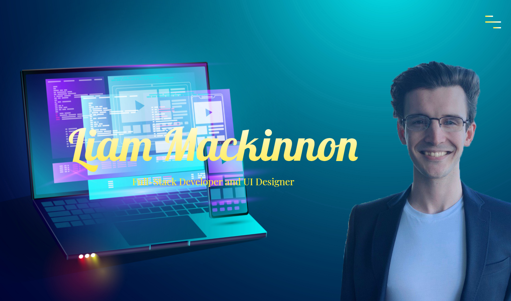

# Personal Portfolio

## Table of Contents
> - [Description](#Description)
> - [Keywords](#Keywords)
> - [Contributors](#Contributors)
> - [Usage](#Usage)
> - [Installation](#Installation)
> - [Test](#Testing)
> - [License](#License)
> - [Deployment](#Deployment)
> - [Questions](#Questions)

## Description
>Responsive Portfolio w/ Vanilla CSS

## Keywords
>*CSS, HTML, SCSS, Portfolio*

## Contributors
>Liam Mackinnon

## Usage 
>Personal use. Feel free to extract template for your own purposes.

## Installation
>*No installation. npm i for README Generator.*

## Testing
>None

## License
>Unlicense

## Deployment
Live Recording?: No  

Screenshot?: Yes

### Questions
>If you have any further questions about the application:
>Email: LMackinnon.inbox@gmail.com
>
>GitHub: www.github.com/liam-mack
